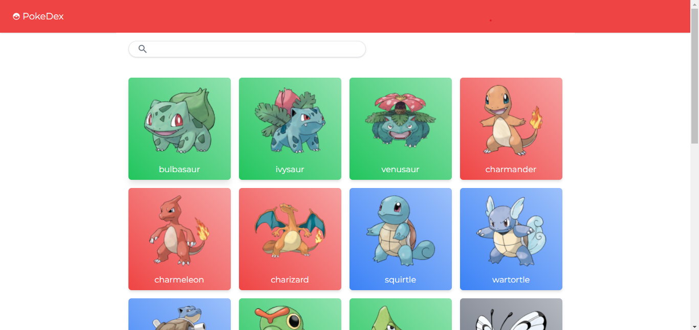

# Luccas' Pokedex



A NextJs web application aimed at showcasing all pokemons in an orderly manner.


## Running locally

First, start the development server

```bash
  yarn dev
```

Then, open up [http://localhost:3000](http://localhost:3000) with your browser of choice to check out the application.
    
## Surge demo

There is also a Surge demo available at:  
[https://luccas-pokedex.surge.sh](https://luccas-pokedex.surge.sh)

Be sure to also check out Surge, if you have not already done so:  
[https://surge.sh](https://surge.sh/)

